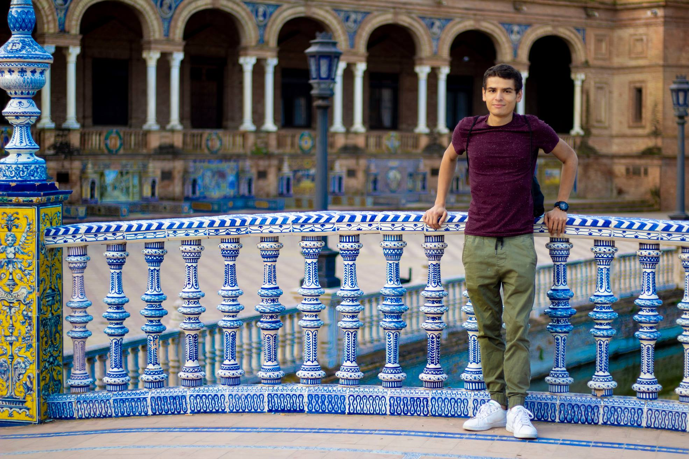

# Motiv-ARCHE

## Nombre del grupo
Heritage Software

## Nombre del proyecto
Motiv-ARCHE

## Integrantes del grupo
* Juan Camilo González Vargas
* Daniela Paola Beltrán Saavedra
* Frank Sebastián Franco
* Ever Iván Lerma

#### Biografía de Juan Camilo González Vargas:

Juan Camilo González es ingenierio de sistemas egresado de la Pontificia Universidad Javeriana. Realizó estudios de maestría con doble titulación en la Javeriana con el título de maestría en Ingeniería de Sistemas y Computación y en la Universitat de Girona, España en Master de Ingeniería Informática. Actualmente se encuentra realizando estudios de doctorado en búsqueda de obtener la doble titulación de las universidades mencionadas anteriormente.

Juan Camilo es un amante de la natación, le gusta aprender de las nuevas tecnologías que van surgiendo en el tiempo, le gusta viajar a diferentes partes del mundo y le encanta escuchar música en sus tiempos libres. 

#### Biografía de Daniela Paola Beltrán Saavedra:

#### Biografía de Frank Sebastián Franco:

#### Biografía de Ever Iván Lerma:

## Entregables:

1.1. [diagrama casos de uso](entregables/tarea semana 4/casos.jpg)
1.2. [archivo word explicación casos de uso](entregables/tarea semana 4/motiv-arche.docx)
2. [diagrama de clases inicial](entregables/tarea semana 4/diagrama.jpg)
3. [Lean Canvas](entregables/tarea semana 4/canvas.docx)
4.1. [Prototipo de baja fidelidad](entregables/tarea semana 4/prototipoBajaFidelidad.pptx)
4.2. [Prototipo en Figma](https://www.figma.com/file/YDxdBOt0p2bApiQ7BYHpVA/Motiv-ARCHE?node-id=0%3A1)